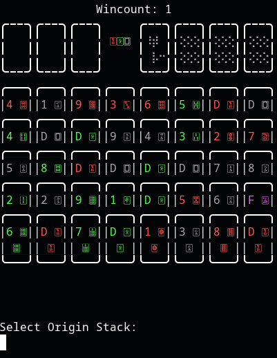

# ShenzhenSolitaireBash
A remake of Zachtronics' "Shenzhen Solitaire" made in a single shell script.



To play, input the stack you want to move and then the place you want to move it to using the 2-character codes on chart below (not case sensitive).
You will be asked for the amount of cards to move if more than one move is valid with given input.

```
                 ┌-DRAGON BUTTONS
                 │
╔═══TABLEAU═══╗  │  ╔════FOUNDATION════╗
╭───╮╭───╮╭───╮ ┌┴┐ ╭───╮╭───╮╭───╮╭───╮
|T 1||T 2||T 3| DDD |F 0||F 1||F 2||F 3|
|   ||   ||   | 123 |   ||   ||   ||   |
╰───╯╰───╯╰───╯     ╰───╯╰───╯╰───╯╰───╯
╭───╮╭───╮╭───╮╭───╮╭───╮╭───╮╭───╮╭───╮
|C 1||C 2||C 3||C 4||C 5||C 6||C 7||C 8|
|   ||   ||   ||   ||   ||   ||   ||   |
╰───╯╰───╯╰───╯╰───╯╰───╯╰───╯╰───╯╰───╯
╚═══════════════COLUMNS════════════════╝
```

To collapse all dragons of a suit to tableau spot input D\[1-3\] depending on suit and then choose a tableau spot.

Input Q at any time to quit.
